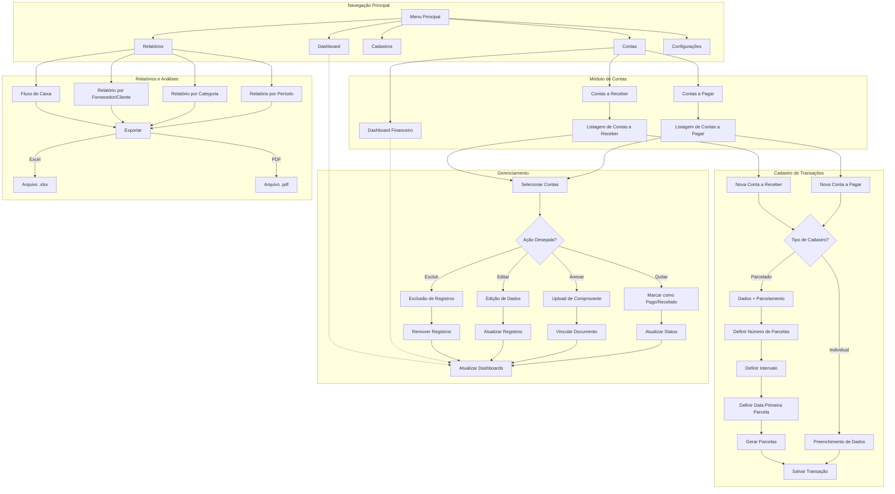

### Funcionalidades Atualizadas

#### 1. Cadastro com Parcelamento

- Opção de cadastro de transação única ou parcelada
- Campos específicos para parcelamento:
    - Número de parcelas
    - Intervalo entre parcelas (em dias)
    - Data do primeiro vencimento
- Geração automática de todas as parcelas com numeração sequencial
- Opção para distribuir o valor total ou repetir o mesmo valor

#### 2. Estrutura de Navegação

- **Menu Lateral Esquerdo** com seções:
    - Dashboard Geral
    - Contas (acesso ao dashboard financeiro geral)
    - Cadastros (Fornecedores/Clientes, Categorias, etc.)
    - Relatórios
    - Configurações
- **Sub-navegação para Contas**:
    - Contas a Pagar (com contador de pendências)
    - Contas a Receber (com contador de pendências)
    - Visão Consolidada

#### 3. Dashboards Hierárquicos

- **Dashboard Geral de Contas**:
    - Balanço entre recebimentos e pagamentos
    - Gráficos comparativos
    - Alertas de vencimentos próximos
- **Dashboards Específicos** para Contas a Pagar e Receber:
    - Distribuição por status
    - Projeção para os próximos meses
    - Indicadores de performance

#### 4. Tabelas Avançadas

- **Tabela de Transações** com:
    - Todas as colunas dos dados cadastrados
    - Filtros individuais para cada coluna
    - Filtro global de busca
    - Botão destacado para adicionar nova transação
    - Ações por linha (editar, excluir, quitar)
    - Ações em lote (seleção múltipla)

#### 5. Ordenação e Filtragem

- Cabeçalhos de coluna clicáveis para ordenação
- Indicador visual de ordenação ativa
- Alternância entre ordenação crescente/decrescente
- Filtros persistentes entre sessões
- Opção para salvar filtros favoritos

#### 6. Operações em Lote

- Seleção múltipla de transações via checkboxes
- Ações em lote:
    - Marcar como pagas/recebidas
    - Definir data de pagamento comum
    - Anexar comprovante único
    - Alterar status
    - Excluir múltiplos registros

### Fluxo de Trabalho

#### 1. Cadastro de Contas com Parcelamento

- Usuário clica em "Nova Conta" em Contas a Pagar ou Receber
- Preenche os dados principais da transação
- Seleciona opção "Parcelado" e informa:
    - Número de parcelas
    - Intervalo entre parcelas
    - Data do primeiro vencimento
- Sistema calcula automaticamente todas as datas e cria os registros

#### 2. Visualização e Gerenciamento

- Tela principal de listagem com tabela completa
- Dados organizados com todas as colunas visíveis
- Opções de ordenação por qualquer coluna
- Filtros avançados disponíveis acima da tabela
- Possibilidade de salvar configurações de filtros

#### 3. Ações em Lote

- Seleção de múltiplos registros via checkboxes
- Menu de ações em lote disponível quando há seleção
- Opções comuns: marcar como pago/recebido, alterar status, excluir
- Confirmação antes de executar ações irreversíveis

#### 4. Dashboard Intuitivo

- Acesso direto a partir do menu lateral
- Visão consolidada de contas a pagar e receber
- Gráficos comparativos de fluxo financeiro
- Alertas de vencimentos e atrasos

### Detalhes Técnicos da Implementação

1. **Backend Django**:
    - Models para todas as entidades
    - Views para operações CRUD e em lote
    - API endpoints para operações assíncronas
2. **Frontend**:
    - Templates Django com componentes responsivos
    - JavaScript para interatividade e validações
    - Filtros dinâmicos e ordenação via AJAX
3. **Banco de Dados**:
    - SQLite para produção, PostgreSQL para armazenamento robusto
    - Relacionamentos bem definidos entre entidades
    - Índices para melhorar performance de consultas

Esta estrutura atende a todos os seus requisitos, oferecendo um sistema completo para gerenciamento financeiro com foco na experiência do usuário e na eficiência operacional.

## Descrição dos Principais Fluxos

### 1. Navegação e Acesso

- O usuário acessa o sistema através da tela de login
- Após autenticação, é direcionado ao Dashboard principal
- A navegação ocorre através do menu lateral esquerdo fixo
- O módulo "Contas" é o coração do sistema, contendo os submenus:
    - Dashboard Financeiro (visão global)
    - Contas a Pagar
    - Contas a Receber

### 2. Cadastro de Contas (Pagar/Receber)

- **Fluxo Individual**:
    - Usuário acessa o módulo (Contas a Pagar ou Receber)
    - Clica no botão "Nova Conta"
    - Preenche os dados (Fornecedor, Data, Valor, etc.)
    - Escolhe o status inicial (geralmente "Pendente")
    - Salva o registro
- **Fluxo Parcelado**:
    - Mesmo início do fluxo individual
    - Seleciona a opção "Parcelado"
    - Preenche dados gerais da transação
    - Define o número de parcelas
    - Define o intervalo entre parcelas (em dias)
    - Define a data da primeira parcela
    - Sistema calcula automaticamente as datas das parcelas
    - Usuário confirma e sistema gera todos os registros

### 3. Gerenciamento de Transações

- **Visualização e Filtros**:
    - Lista de transações com todas as colunas visíveis
    - Filtros disponíveis para cada coluna
    - Ordenação através de cliques nos cabeçalhos
    - Paginação para navegação entre registros
- **Ações Individuais**:
    - Editar: Alterar dados de um registro específico
    - Quitar: Marcar como pago/recebido e registrar a data
    - Anexar: Vincular comprovantes ao registro
    - Excluir: Remover registro (com confirmação)
- **Ações em Lote**:
    - Selecionar múltiplos registros via checkboxes
    - Escolher ação desejada para todos os selecionados
    - Confirmar a operação
    - Sistema processa todos os registros de uma vez

### 4. Relatórios e Análises

- Acesso pelo menu "Relatórios"
- Seleção do tipo de relatório desejado
- Definição de parâmetros (período, categorias, etc.)
- Geração de visualização na tela
- Opção de exportar para Excel ou PDF
- Armazenamento de relatórios frequentes como favoritos

## FRONT

paleta de cores:

#010911
R1 G9 B17
C94 M79 Y59 K89

#F53101
R245 G49 B1
C0 M88 Y97 K0

#F2F3F4
R242 G243 B244
C6 M4 Y7 K0

#FA820D
R250 G130 B13
C0 M58 Y94 K0

O forte contraste entre o tom escuro, o
gelo e as cores secundárias chamam a
atenção, de forma a destacar a marca em
meio a muitas em ruas movimentadas do
centro ou no meio digital.
Evitamos usar o preto e branco puro para
não ser tão agressivo aos olhos e trazer
mais refinamento para a identidade.

Os tons quentes aparecem para trazer
aconchego, calor e acolhimento, principal
diferencial da marca GVD, sendo o laranja
a cor predominande da marca.

FAMÍLIAS

TIPOGRÁFICAS

AXIFORMA

Fira Sans (Google Fonts)